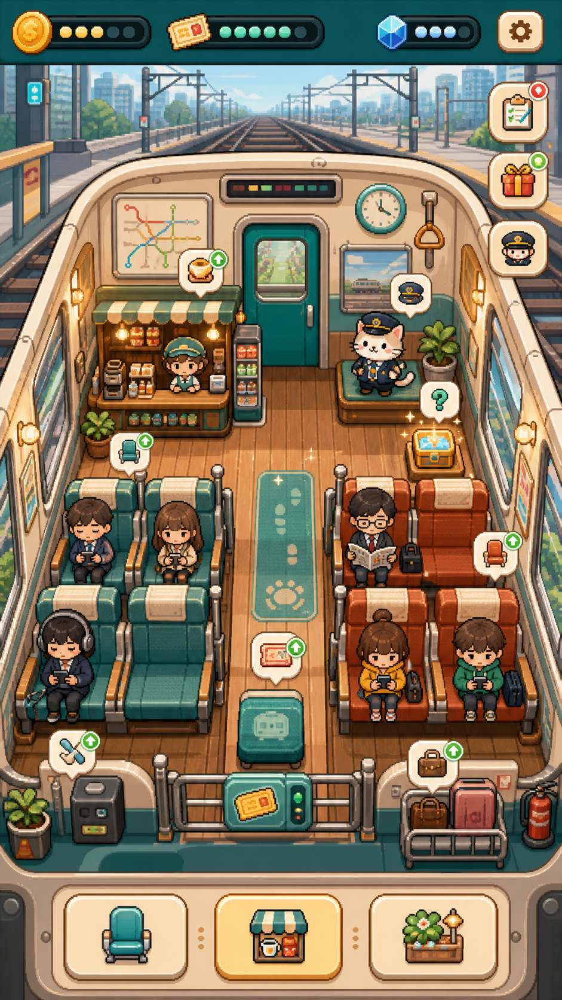

# Step 16. 출퇴근 열차 픽셀 힐링 타이쿤 아트/UI 방향

## 목표

이번 단계의 목표는 기능을 더 붙이는 것이 아니라, 게임의 얼굴을 정하는 것이다. 참고 게임에서 가져올 것은 "작은 픽셀 월드", "쉬운 터치", "힐링 성장감"이고, 그대로 따라가면 안 되는 것은 섬, 농장, 곡괭이, 판타지 확장 구조다.

우리 게임의 아이덴티티는 다음 한 문장으로 잡는다.

> 매일 이동하는 내 생활이 귀여운 열차를 성장시키는 게임

따라서 화면의 중심은 UI 카드가 아니라, 출퇴근 열차 객실이라는 작은 세계여야 한다.

## 생성한 목표 시안



이 시안은 최종 화면을 그대로 복제하기 위한 것이 아니라 방향 기준이다. 실제 앱에 적용할 때는 복잡도를 줄이고, 우리 게임의 모바일 방치형 루프에 맞게 단순화한다.

## 가져갈 점

- 객실 전체가 하나의 작은 픽셀 월드처럼 보인다.
- 좌석, 매점, 장식, 승객, 분실물이 같은 장면 안에 자연스럽게 들어간다.
- 상단 재화 UI는 작고, 중앙 플레이 공간이 화면 대부분을 차지한다.
- 오브젝트 위 말풍선과 작은 가격표가 "여기를 누르면 된다"는 신호를 준다.
- 창밖 철도, 노선도, 승차권, 역장 고양이 같은 요소가 출퇴근 열차 정체성을 만든다.
- 좌석과 매점이 단순 버튼이 아니라 실제 객실 오브젝트처럼 보인다.

## 덜어낼 점

- 오른쪽 세로 퀘스트 버튼은 MVP에서는 제거하거나 이벤트 단계까지 미룬다.
- 화면 안 오브젝트 수가 너무 많아지면 작은 폰에서 피로해질 수 있다.
- 텍스트가 들어간 이미지 에셋은 AI 생성 시 깨질 가능성이 높으므로, 텍스트는 Flutter UI로 얹는다.
- 최종 앱은 과한 장식보다 "누를 곳이 명확한 객실"을 우선한다.
- 상단 재화 종류는 골드, 워프 포인트, 초당 수익 정도로 제한한다.

## 최종 아트 방향

추천 스타일은 "고해상도 픽셀 감성 2D 일러스트"다.

순수 저해상도 도트가 아니라, 모바일에서 잘 보이도록 선명하고 부드럽게 만든다. 픽셀 게임처럼 귀엽게 보이지만 실제 파일은 큰 PNG로 제작한다.

핵심 규칙:

- 굵고 어두운 외곽선
- 작은 화면에서도 읽히는 단순한 실루엣
- 크림색 벽, 민트/청록 포인트, 따뜻한 노란 조명
- 출퇴근을 떠올리게 하는 노선도, 승차권, 창밖 도시, 철도, 손잡이
- 캐릭터는 과하게 리얼하지 않고 둥근 SD 형태
- 모든 오브젝트는 누를 수 있는 게임 말처럼 보여야 한다.

피해야 할 것:

- 농장섬, 판타지 왕국, 광산, 곡괭이 같은 레퍼런스 게임의 소재
- 지나치게 어두운 지하철 현실감
- 너무 많은 카드형 UI
- 텍스트가 박힌 PNG
- 한 화면에 너무 많은 이벤트 버튼

## 메인 화면 UX 구조

```text
상단 얇은 상태바
골드 / 워프 포인트 / 초당 수익 / 설정

중앙 메인 객실 씬
창밖 풍경
노선도, 시계, 손잡이
좌석 Lv 오브젝트
매점 Lv 오브젝트
창가/벽/바닥 장식 슬롯
승객 3~5명
역장 고양이
분실물 반짝임
수익 +G 플로팅

하단 네비게이션
객실 / 이동 / 상점
```

사용자가 보는 첫 느낌은 "앱 대시보드"가 아니라 "작은 열차 객실에 들어왔다"여야 한다.

## 상호작용 규칙

- 좌석을 누르면 좌석 업그레이드 또는 부족 골드 안내가 나온다.
- 매점을 누르면 매점 업그레이드 또는 부족 골드 안내가 나온다.
- 빈 장식 슬롯을 누르면 해당 위치에 맞는 장식 후보 2~3개만 뜬다.
- 이미 산 장식은 같은 위치에서 업그레이드한다.
- 분실물은 반짝이고, 누르면 즉시 보상을 준다.
- 승객은 직접 관리 대상이 아니라 객실이 살아있게 만드는 연출이다.
- 첫 세션에는 "좌석 승급" 같은 목표 티켓 하나만 보여준다.

## 1차 에셋 제작 순서

처음부터 모든 이미지를 만들지 않는다. 아래 순서로 붙여야 앱이 빠르게 게임처럼 보인다.

1. `cabin_topdown_default.png`: 메인 객실 배경
2. `seat_lv1.png`, `seat_lv2.png`, `seat_lv3.png`: 좌석 성장
3. `kiosk_lv1.png`, `kiosk_lv2.png`, `kiosk_lv3.png`: 매점 성장
4. `passenger_worker.png`, `passenger_student.png`, `passenger_vip.png`: 승객
5. `mascot_station_cat.png`: 역장 고양이
6. `lost_box_lv1.png`: 분실물 박스
7. `route_map_lv1.png`, `tiny_plant_lv1.png`, `soft_rug_lv1.png`: 장식 1차
8. `ticket_badge.png`, `upgrade_bubble.png`: UI 소품

## 이미지 생성 프롬프트 기준

메인 화면 시안:

```text
Original vertical smartphone game screen mockup for a cozy commuting train tycoon.
Top-down slightly isometric 2D train carriage as a tiny pixel-art world.
Warm cream walls, teal trims, wooden floor, large train windows with city rail scenery,
upgradeable train seats, small snack kiosk, route map, ticket markers,
tiny commuter passengers, station cat mascot, sparkling lost-item box.
High-resolution pixel-art inspired mobile game UI, cute Korean casual game feel,
crisp silhouettes, soft teal, mint, cream, yellow, coral, brown palette.
Minimal top resource bar, large center train-world scene, bottom navigation with three icon buttons.
No readable text, no logos, no farming island, no pickaxe, no medieval fantasy, no copied existing game composition.
```

개별 오브젝트:

```text
Cute 2D mobile game asset for a cozy commuting train tycoon.
High-resolution pixel-art inspired style, clean dark outline, simple readable silhouette,
warm cream and teal train cabin palette, transparent background, centered single object,
no text, no logo, no shadow on background.
```

## Flutter 적용 방향

현재 `TrainCabin`은 코드 기반 임시 그림을 그리고 있다. 다음 단계에서는 한 번에 전부 교체하지 않고, 아래 순서로 PNG를 섞는다.

1. 배경만 PNG로 교체하고 좌석/매점은 기존 `CustomPainter` 유지
2. 좌석과 매점 PNG를 각각 레벨별로 교체
3. 승객과 고양이를 PNG 스프라이트로 교체
4. 분실물과 장식 슬롯을 PNG로 교체
5. 마지막에 말풍선, 가격표, 티켓 UI를 Flutter 위젯으로 정리

이 방식이면 그래픽을 붙이는 중에도 게임이 계속 실행되고, 마음에 안 드는 에셋만 빠르게 교체할 수 있다.

## 다음 실행 작업

Step 17은 이 문서를 기준으로 실제 메인 객실 배경 PNG와 핵심 오브젝트 PNG를 만들고 앱에 붙이는 단계다.

추천 작업명:

`Step 17. 메인 객실 배경과 핵심 오브젝트 PNG를 생성해서 Flutter 씬에 적용`
